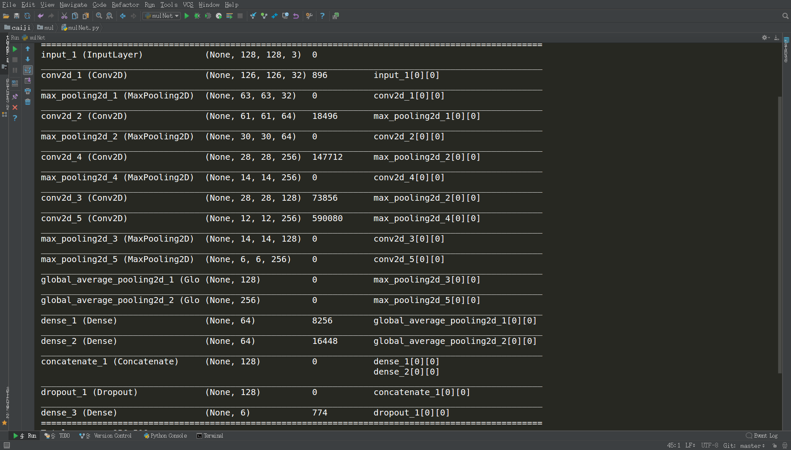

# Classification-using-Keras
First step to Keras!
multi-class classification using Keras

mulNet里面两个函数,分别是自己打间的网络模型和使用了修改版迁移学习vgg16的模型，自己搭建的网络结构，目的是为了学习函数式搭建网络的方法和是使用concate将不同的层之间连接起来。类似于multi scale的概念，数据集受限。没有爬取更多的图片。

搞了一晚上，一直以为是写的网络结构有问题，导致loss一直很大，train_acc, val_acc 还几乎保持不变

后来调小了learning_rate就恢复正常了，准确率可以到0.94左右，虽然自己设计的结构效果与人家的还是差一点。。。

下一步就是找有multi-label的数据集，实现multi-task的任务啦。